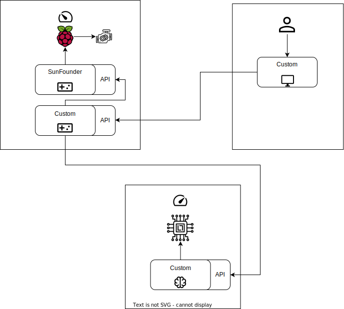

# Praxisprojekt
**Entwicklung eines Fahrassistenzsystems**

# Inhaltsverzeichnis

- [Praxisprojekt](#praxisprojekt)
- [Inhaltsverzeichnis](#inhaltsverzeichnis)
- [Verzeichnisse](#verzeichnisse)
- [Hardware](#hardware)
- [Architektur](#architektur)
- [Einrichtung des Systems](#einrichtung-des-systems)
  - [Bereitstellung des KI-Modells](#bereitstellung-des-ki-modells)
  - [Einrichtung der Raspberry-Pi Software](#einrichtung-der-raspberry-pi-software)
  - [Bedienung der grafischen Benutzeroberfläche](#bedienung-der-grafischen-benutzeroberfläche)

# Verzeichnisse

| Pfad | Beschreibung |
| --- | :---: |
| [`datasets`](https://github.com/Tracer1337/praxisprojekt-fom/tree/main/datasets) | In diesem Projekt Verwendete Datensätze |
| [`docs`](https://github.com/Tracer1337/praxisprojekt-fom/tree/main/docs) | Dokumentation über Teile dieses Projektes |
| [`gui`](https://github.com/Tracer1337/praxisprojekt-fom/tree/main/gui) | Multifunktionale grafische Benutzeroberfläche |
| [`models`](https://github.com/Tracer1337/praxisprojekt-fom/tree/main/models) | Vortrainierte KI-Modelle zur Straßenschilderkennung |
| [`notebooks`](https://github.com/Tracer1337/praxisprojekt-fom/tree/main/notebooks) | Einblicke in Azure ML Studio |
| [`raspi`](https://github.com/Tracer1337/praxisprojekt-fom/tree/main/raspi) | Programme zur Ausführung auf einem Raspberry-Pi |
| [`yolov5`](https://github.com/Tracer1337/praxisprojekt-fom/tree/main/yolov5) | Kopie des YOLOv5 Repositories mit eigenen Erweiterungen |

# Hardware

* [Raspberry Pi 3 Model B](https://www.amazon.de/Raspberry-Pi-Model-ARM-Cortex-A53-Bluetooth/dp/B01CD5VC92)
* [Raspberry Pi Video Car Kit (Picar-V)
](https://www.sunfounder.com/products/smart-video-car)
* [18650 Akku](https://www.amazon.de/dp/B0BF4WBD5B)

# Architektur

# Einrichtung des Systems

## Bereitstellung des KI-Modells

1. Repository auf einen performanten Rechner klonen
2. In das Verzeichnis `yolov5` navigieren
3. Folgenden Befehl ausführen: `python restapi.py --model yolov5n-1280-gtsdb-full`

## Einrichtung der Raspberry-Pi Software

1. Repository auf den im Bausatz verbauten Raspberry-Pi klonen
2. In das Verzeichnis `raspi` navigieren
3. Datei `.env.example` nach `.env` kopieren
4. Fehlende Werte in der Datei `.env` ergänzen
5. Folgenden Befehl ausführen: `pip3 install -r requirements.txt`
6. In neuem Terminal in das Verzeichnis `SunFounder_PiCar-V/remote_control` navigieren
7. Folgenden Befehl ausführen: `./start`
8. Folgenden Befehl im urspünglichen Terminal ausführen: `python3 main.py`

## Bedienung der grafischen Benutzeroberfläche

* Bei aktiver Internetverbindung: [GitHub Pages](https://tracer1337.github.io/praxisprojekt-fom)
* Alternativ über lokalen Rechner: [Bereitstellung der Benutzeroberfläche](https://github.com/Tracer1337/praxisprojekt-fom/blob/main/gui/README.md#bereitstellung)
